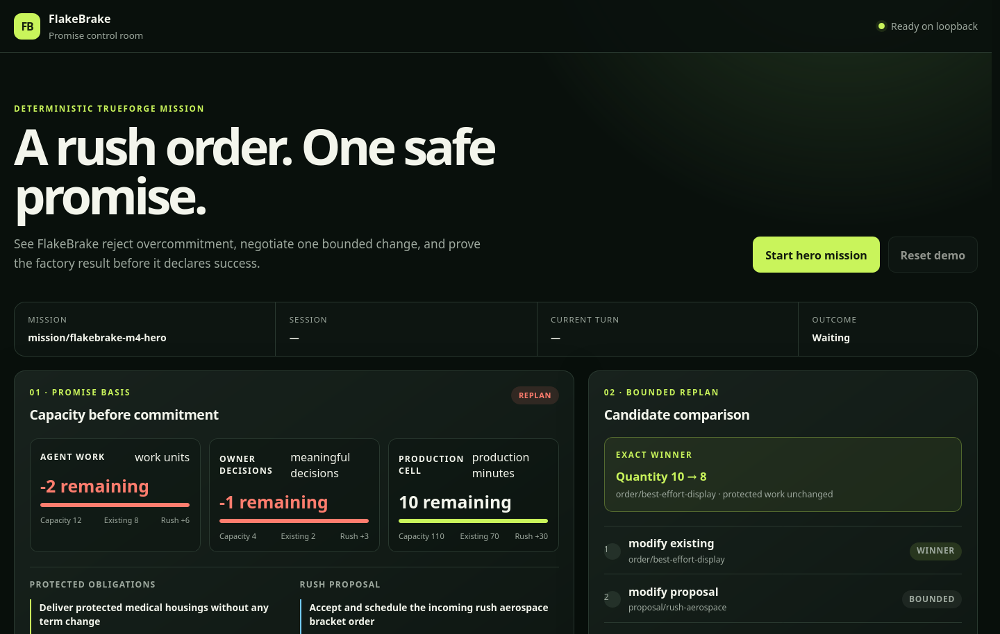
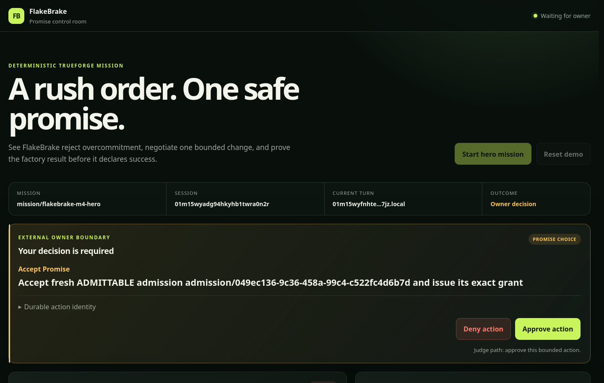
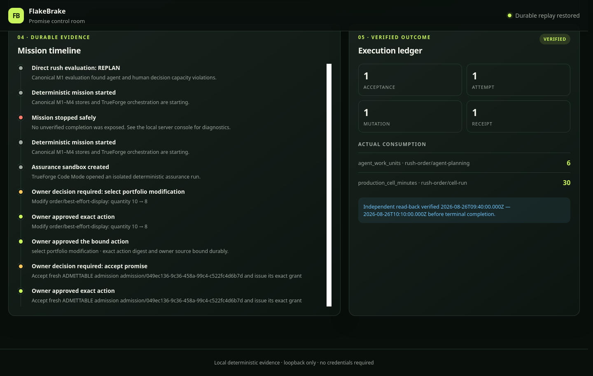

# FlakeBrake

FlakeBrake is obligation admission control for autonomous agents: it stops an
agent from accepting a promise unless the complete, versioned system can keep
that promise and later prove the approved effect actually happened.

The polished v0.1 demonstration is a synthetic microfactory. A rush order
arrives while protected, important, and best-effort orders already consume
finite human-review, agent-work, and production-cell capacity. FlakeBrake
evaluates the whole portfolio, proposes the smallest safe replan, obtains
explicit owner decisions, blocks a denied effect even through an equivalent
tool representation, executes exactly one approved alternative, and verifies
it by independent read-back.



## The operational problem

Agent systems are good at producing a plausible next action. They are much less
reliable at deciding whether a new commitment remains feasible alongside every
promise already accepted. A local action can look safe while the portfolio as a
whole exceeds a human decision budget, agent work budget, deadline, production
window, or an authorization boundary.

That gap creates a dangerous failure mode: the agent says “yes” first and only
discovers the conflict while executing. Renaming a denied action, switching
tools, replaying an approval, reconnecting after a lost response, or racing a
database replacement can make the gap worse unless identity and durable state
are enforced mechanically.

## Why ordinary scheduling agents fail

An ordinary planner can optimize a schedule it was shown, but its conclusion is
not an authorization. It may omit protected work, trust stale capacity, reuse an
old evaluation, interpret a tool rename as a new effect, or report completion
before an external mutation is independently observed. Natural-language memory
does not provide atomic acceptance, exact-once execution, immutable evidence,
or replay-safe recovery.

FlakeBrake separates those concerns:

- deterministic code computes feasibility and stable effect identity;
- an immutable ledger binds admission to exact portfolio, capacity,
  authorization, evidence, and calibration versions;
- explicit external owners decide consequential actions;
- grants, denials, fences, attempts, receipts, and actuals are durable;
- TrueForge orchestrates agents, subagents, sandbox work, MCP calls, pauses, and
  restart/resume without replacing FlakeBrake's policy kernel;
- terminal success is exposed only after an independent factory read-back.

## What FlakeBrake does

1. Reads the accepted-obligation portfolio and declared multi-resource
   capacity.
2. Evaluates the rush proposal against the complete authoritative basis.
3. Returns `ADMITTABLE`, `REPLAN`, or `REJECT`; evaluation alone never mutates
   the portfolio or factory.
4. For `REPLAN`, compares complete candidate portfolios and preserves protected
   obligations.
5. Requires the owner to approve the selected existing-order modification,
   then creates a fresh admission for the resulting portfolio.
6. Atomically accepts the fresh `ADMITTABLE` promise and its exact grant.
7. Persists owner denials as active constraints that survive equivalent MCP or
   schema representations.
8. Claims one fenced execution attempt, performs one synthetic mutation, stores
   one receipt, reads the factory independently, and records actual consumption
   before terminal verification.

## Three-minute hero scenario

The deterministic judge flow is designed to be understood in about three
minutes:

1. The direct rush plan is `REPLAN` because simultaneous capacity constraints
   are exceeded.
2. Candidate comparison selects the bounded modification of an existing
   best-effort order from quantity 10 to 8; protected work is unchanged.
3. The owner approves that modification and then accepts the fresh
   portfolio-v2 `ADMITTABLE` promise.
4. The owner denies the primary 09:10–09:40 reservation.
5. The active M2 denial mechanically blocks the same effect submitted through
   the alternate `submit_schedule_change` adapter—without another owner call or
   mutation.
6. The owner approves the distinct 09:40–10:10 alternative.
7. Exactly one attempt, mutation, and receipt are recorded. Independent
   read-back precedes terminal verified success, with actual consumption of 6
   agent work units and 30 production-cell minutes.
8. Refreshing the browser replays the same mission/session and terminal
   projection without repeating owner calls or effects.

See the timed [demo script](docs/demo-script.md) for narration and checkpoints.

## Challenge FlakeBrake assurance lab

The judge UI also includes an optional, clearly separated **Challenge
FlakeBrake** panel. It is a deterministic assurance demonstration, not a
replacement for the normal hero mission. One keyboard-accessible control runs
six bounded cases against separate invocation-owned M2 and factory stores:

- admission, grant, owner-decision, and plan identity substitution;
- stale authoritative factory compare-and-swap basis;
- conflicting reuse of an execution-attempt identity;
- a caller-forged mutation receipt presented as verified success;
- an equivalent v2 effect representation after a durable v1 denial; and
- a valid replay through the alternate schedule-change adapter as a positive
  control.

Every case uses the existing public store or `factory-change-control` MCP path.
The panel shows the redacted action, authoritative reason, enforced rule, all
eight requested before/after counts, and SHA-256 digests of complete canonical
M2 + factory snapshots. A rejection passes only when every table and row is
equal before and after. The replay control additionally requires the original
result and receipt, one mutation, and no duplicate actual facts. It uses no
credentials or external providers and exposes no filesystem paths.

## Architecture overview

FlakeBrake is deliberately layered:

- **M1 — deterministic admission kernel:** pure portfolio feasibility,
  calibration, candidate ranking, Promise Basis, and typed effect comparison.
- **M2 — durable scheduler and ledger:** SQLite-backed immutable admissions,
  owner choices, atomic acceptance/grant, denials, allowances, attempts,
  receipts, actual facts, and versioned authorization state.
- **M3 — synthetic factory and MCP boundary:** an owned factory environment,
  exact-once mutation, independent read-back, stdio and Streamable HTTP MCP
  lifecycle.
- **M4 — TrueForge mission orchestration:** root agent, three subagents, sandbox
  execution, four MCP connectors, external owner pauses, durable session/turn
  recovery, and terminal reconstruction.
- **M5 — judge UI:** a loopback HTTP service and static browser client that
  project canonical backend state. Browsers never open SQLite directly.

Read [docs/architecture.md](docs/architecture.md) for the trust boundaries and
data flow.

## TrueForge's central role

The mission runs inside the pinned TrueForge 0.1.4 server through the pinned
0.1.3 SDK. The root obligation commander creates exactly three visible roles:

- portfolio and order analyst;
- capacity and schedule analyst;
- assurance and simulation engineer.

TrueForge owns the agent loop, session and turn graph, subagent threads,
sandbox execution, MCP connector use, and approval pauses. The deterministic
judge mode still launches the real local TrueForge server and exercises those
interfaces; it replaces only the stochastic model/provider with a bounded local
deterministic model so judging needs no credentials or network provider.

## MCP services and tools

The four bounded Streamable HTTP services are:

- **factory-orders:** `read_orders`, `read_incoming_proposals`;
- **factory-capacity:** `read_capacity_plan`, `read_actual_consumption`;
- **factory-simulator:** `evaluate_candidate_schedules`,
  `evaluate_hero_fixture`;
- **factory-change-control:** `read_schedule_state`,
  `create_schedule_reservation`, `submit_schedule_change`, admission and
  approval preparation/recording tools, execution status, and verification.

Consequential calls use normalized typed effects, exact admission/grant
identity, idempotency keys, allowance fencing, and verified database handles.
The alternate schedule adapter cannot bypass an active denial for the same
material effect.

## Sandbox and subagent use

The assurance subagent performs meaningful generated-code analysis in an
isolated TrueForge sandbox and uses MCP clients to recompute demand, candidate
ranking, and protected-order preservation. The deterministic mode uses the
local sandbox provider. Optional genuine mode uses a separately configured
Daytona provider. Generated code never makes owner decisions or directly
performs consequential mutations.

## Human approval and denial flow

Every consequential owner request shows the exact mission, predecessor turn,
tool/action, expected effect, action digest, and owner-source identity. The UI
does not auto-approve: the judge selects **Approve action** or **Deny action**.
A response can authorize only the exact digest and arguments displayed.
Missing, stale, malformed, replayed-with-different-arguments, or wrong-mission
responses fail closed.



The deterministic hero requires four external-owner calls: approve the
portfolio modification, approve promise acceptance, deny the primary schedule
effect, and approve the distinct alternative. The equivalent alternate
representation is denied mechanically and does not consume another owner call.

## Durable admission, grant, mutation, and read-back

The durable lifecycle is:

```text
portfolio basis -> admission -> owner decision -> acceptance + grant
  -> allowance claim + fence + attempt -> one factory mutation + receipt
  -> independent read-back -> actual-consumption facts -> terminal verification
```

Acceptance and grant issuance are one transaction. A consequential attempt is
bound to the fresh `ADMITTABLE` admission and complete immutable authorization
request. Retries return the original durable pair/result; conflicting identity
or arguments create no mutation.



## Reconnect and restart behavior

Mission, TrueForge session, turn graph, cursor, approvals, tool results, and
terminal projection are durable. Browser refresh calls the read-only state API
and replays that projection; it does not restart the mission. Lost approval
responses reconcile to their existing successor turn and tool result. Same-
mission retries converge, while conflicting environment or database-incarnation
bindings fail closed.

The M5 client also uses monotonic request generations and durable revisions so
an older poll cannot overwrite a newer approval or regress terminal success.

## Canonical mission evidence

After terminal verification, the execution ledger exposes **Download evidence
JSON**. The read-only `/api/evidence` endpoint returns a versioned canonical
Mission Evidence Bundle and a SHA-256 digest of its exact payload. The digest is
a commitment to those bytes; it does not authenticate the producer.

Verify a downloaded bundle by itself, or require an exact match to the three
durable source databases:

```bash
npm run evidence:verify -- --bundle /absolute/path/mission-evidence.json
npm run evidence:verify -- \
  --bundle /absolute/path/mission-evidence.json \
  --data-dir /absolute/path/to/m5-data
```

The verifier opens source databases read-only and validates canonical encoding,
schema, digest, linkage, exact counts, independent read-back, and terminal
consistency. See [the evidence format and trust boundary](docs/mission-evidence.md).

## Deterministic judge mode

### Prerequisites

- Node.js 22 or newer;
- npm (the version bundled with Node 22 is sufficient);
- a local Firefox installation for the automated browser smoke test;
- Git for cloning.

OpenAI and Daytona credentials are **not** required for the judge UI.

### Fresh-clone setup

```bash
git clone https://github.com/dvellon/flakebrake.git
cd flakebrake
npm ci
npm run typecheck
npm run build
```

### One-command UI startup

```bash
npm run m5:ui
```

Open `http://127.0.0.1:4173`, choose **Start hero mission**, and follow
the four owner prompts. The service binds to loopback by default. Press
`Ctrl+C` for bounded cleanup. An alternate port can be selected with
`npm run m5:ui -- --port 4174`.

### Complete credential-free verification

```bash
npm ci
npm run typecheck
npm run build
npm test
npm run test:m5
npm run test:m5:browser
```

Without M0 configuration, the complete `npm test` run intentionally skips the
two genuine-provider tests. All deterministic M1–M5 tests still run. The browser
command drives the hero mission, recovery, owner decisions, verification,
refresh/reconnect, keyboard focus, tablet layout, and clean shutdown in Firefox.

### Explicit recovery demonstration

The optional recovery demonstration is a separate mode and cannot be activated
from the standard hero UI. It uses fresh invocation-owned SQLite databases,
binds only to loopback, and deliberately closes its owning runner at either of
two exact deterministic boundaries:

- after the M2 execution fence is durable and before the factory mutation;
- after the factory transaction commits and before M2 binds its receipt.

Start it on its dedicated default port:

```bash
npm run recovery:demo
```

Open `http://127.0.0.1:4177`, select a boundary, then advance the visible
interruption, restart, recovery/verification, and completed-replay stages. No
credentials or process-wide kill commands are used. The focused browser check
is `npm run test:recovery:browser`.

## Optional genuine OpenAI/Daytona mode

Genuine mode is an additional assurance gate, not a judging prerequisite. It
requires an external TrueForge 0.1.4 M0 database that already contains a proven
OpenAI model provider and Daytona sandbox provider, plus an explicit external
owner-source identity. Do not commit that database or its credentials.

```bash
FLAKEBRAKE_M0_DATABASE_PATH=/absolute/path/to/external/m0.sqlite \
FLAKEBRAKE_OWNER_SOURCE_ID=owner/local-terminal \
npm run m4:live
```

The CLI displays each exact pending action on the terminal and reads an explicit
`ALLOW` or `DENY`. Keep the M0 database outside the repository with owner-only
permissions. Never place API keys in command lines, source files, screenshots,
or tracked environment files.

## Repository structure

```text
src/kernel.ts, scheduling.ts       M1 deterministic admission and replanning
src/store.ts, sqlite.ts             M2 immutable ledger and transactions
src/factory-environment.ts          owned synthetic factory state
src/mcp.ts, mcp-http.ts             M3 MCP services and lifecycle
src/m4-*.ts, trueforge-runtime.ts    M4 TrueForge mission integration
src/m5-ui.ts, m5-cli.ts             M5 loopback judge service
ui/m5/                              static accessible browser client
test/                               mechanical, integration, and browser gates
docs/PRODUCT_SPEC_v0.1.md           frozen normative product specification
docs/DECISION_LOG.md                frozen reviewed decision history
docs/architecture.md                implementation and trust-boundary overview
docs/demo-script.md                 approximately three-minute judge walkthrough
docs/submission.md                  submission-form-ready project summary
```

## Security and data handling

- The judge service binds to `127.0.0.1`, validates request target, origin,
  method, content type, JSON shape, mission identity, and action digest, and
  bounds request bodies and shutdown drain time.
- Browser clients receive projected canonical state, never filesystem paths,
  credentials, provider manifests, or direct database access.
- Deterministic invocation data is created in an owned temporary root and is
  removed during successful shutdown. An explicit `--data-dir` must be an
  absolute caller-owned path.
- SQLite store kind and immutable incarnation identity prevent cross-store or
  same-path replacement from passing mission binding.
- `.env*`, SQLite databases/sidecars, logs, dependencies, and build output are
  ignored. Repository scans verify they are not tracked.
- The synthetic mutation affects only the invocation-owned demonstration
  factory. FlakeBrake v0.1 does not connect to a real production system.

## Limitations and deliberate tradeoffs

- v0.1 is a bounded microfactory admission controller, not a general-purpose
  scheduler or a fulfillment guarantee.
- Capacity and work-cost assumptions are declared and versioned; FlakeBrake
  does not infer human competence, fatigue, or long-term availability.
- The judge UI is loopback-only and intentionally has no production
  authentication or multi-user deployment model.
- Deterministic mode proves orchestration and safety mechanics but not the
  quality of an arbitrary external model. Genuine OpenAI/Daytona evidence is a
  separate optional gate.
- SQLite and a single-process local service keep the demonstration inspectable;
  distributed deployment, real factory integration, learned forecasting, and
  generalized domains are explicitly deferred.

## Qodo Code Review Evidence

FlakeBrake's implementation PRs were reviewed by the GitHub Qodo application,
remediated with focused regressions, re-reviewed at exact heads, and merged only
after a separate human adjudication. The links below are the public audit trail;
they are evidence of the review process, not a claim that automated review can
replace testing or human approval.

### PR #5 — M4 TrueForge mission orchestration

- [Merged PR #5](https://github.com/dvellon/flakebrake/pull/5) and
  [initial Qodo review](https://github.com/dvellon/flakebrake/pull/5#pullrequestreview-5045223340).
- Representative findings include the High/Security
  [live-owner bypass](https://github.com/dvellon/flakebrake/pull/5#discussion_r3875476637),
  High/Correctness
  [non-atomic acceptance/grant](https://github.com/dvellon/flakebrake/pull/5#discussion_r3875476651),
  and High/Reliability
  [rollback overwriting concurrent writes](https://github.com/dvellon/flakebrake/pull/5#discussion_r3883517915).
- Remediation evidence:
  [Round 1](https://github.com/dvellon/flakebrake/pull/5#issuecomment-5445667179),
  [Round 6](https://github.com/dvellon/flakebrake/pull/5#issuecomment-5456855603), and
  [Round 7](https://github.com/dvellon/flakebrake/pull/5#issuecomment-5457425075).
- [Exact-head completion](https://github.com/dvellon/flakebrake/pull/5#issuecomment-5457617145),
  [final adjudication](https://github.com/dvellon/flakebrake/pull/5#issuecomment-5457679838), and
  [merge commit](https://github.com/dvellon/flakebrake/commit/5ec00e7c575e6f426ee509dcdc8e38a3c5f7c427).

### PR #6 — SQLite contention test protocol

- [Merged PR #6](https://github.com/dvellon/flakebrake/pull/6) and
  [initial Qodo review](https://github.com/dvellon/flakebrake/pull/6#pullrequestreview-5055906542).
- Qodo caught a High test-reliability gap where the child reported readiness
  [before SQLite contention was proven](https://github.com/dvellon/flakebrake/pull/6#discussion_r3884763780),
  followed by lifecycle findings including
  [startup exit handling](https://github.com/dvellon/flakebrake/pull/6#discussion_r3884867669).
- Remediation summaries:
  [Round 1](https://github.com/dvellon/flakebrake/pull/6#issuecomment-5459102529),
  [Round 2](https://github.com/dvellon/flakebrake/pull/6#issuecomment-5459279110), and
  [Round 3](https://github.com/dvellon/flakebrake/pull/6#issuecomment-5459551376).
- [Exact-head completion](https://github.com/dvellon/flakebrake/pull/6#issuecomment-5459582968),
  [final adjudication](https://github.com/dvellon/flakebrake/pull/6#issuecomment-5459587911), and
  [merge commit](https://github.com/dvellon/flakebrake/commit/f80ca6fd9986a78fa62d5ee88e05f67ac86124a3).

### PR #7 — M5 judge UI

- [Merged PR #7](https://github.com/dvellon/flakebrake/pull/7) and
  [initial Qodo review](https://github.com/dvellon/flakebrake/pull/7#pullrequestreview-5056369610).
- Representative corrections include Medium/Reliability
  [monotonic polling](https://github.com/dvellon/flakebrake/pull/7#discussion_r3885152164),
  High/Correctness
  [durable failed-mission recovery](https://github.com/dvellon/flakebrake/pull/7#discussion_r3885293826),
  and High/Reliability
  [malformed-target containment](https://github.com/dvellon/flakebrake/pull/7#discussion_r3885462841).
- Remediation summaries:
  [Round 1](https://github.com/dvellon/flakebrake/pull/7#issuecomment-5459839988),
  [Round 2](https://github.com/dvellon/flakebrake/pull/7#issuecomment-5460058884), and
  [Round 3](https://github.com/dvellon/flakebrake/pull/7#issuecomment-5460220141).
- [Exact-head completion](https://github.com/dvellon/flakebrake/pull/7#issuecomment-5460255563),
  [final adjudication](https://github.com/dvellon/flakebrake/pull/7#issuecomment-5460262808), and
  [merge commit](https://github.com/dvellon/flakebrake/commit/6829ae2cc87a9fd34d28026cf7cbf822cefd9c2a).

Earlier milestone review trails remain available in merged
[PR #2](https://github.com/dvellon/flakebrake/pull/2),
[PR #3](https://github.com/dvellon/flakebrake/pull/3), and
[PR #4](https://github.com/dvellon/flakebrake/pull/4).

## AI-assistance disclosure

OpenAI Codex assisted with implementation, testing, documentation drafting, and
review orchestration. The human owner defined the product thesis, frozen
specification, safety requirements, bounded scope, acceptance gates, and merge
decisions, and reviewed the resulting evidence. The GitHub Qodo application
performed independent PR review; its findings and remediation trail are linked
above. AI output was not treated as proof: deterministic tests, genuine-provider
gates where applicable, exact-head reviews, and human merge authorization were
required.

## License

FlakeBrake is licensed under the [MIT License](LICENSE). Dependencies and
third-party tools retain their own licenses.
