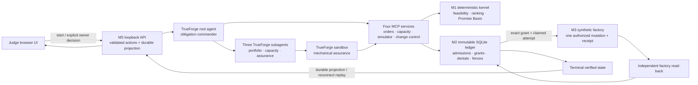

# FlakeBrake architecture

FlakeBrake separates planning, authorization, execution, and verification so a
model's proposed action never becomes a promise or mutation by implication.
The normative behavior remains in the frozen
[product specification](PRODUCT_SPEC_v0.1.md); this document is an implementation
map for evaluators.

## End-to-end data flow

## Layers and responsibilities

### M1: deterministic admission kernel

The kernel consumes a complete, versioned portfolio, proposal, capacity model,
capacity plan, authorization state, reservations, and calibration frontier. It
recomputes feasibility without side effects and returns `ADMITTABLE`, `REPLAN`,
or `REJECT`. Replan candidates are complete portfolio states; protected
obligations are hard constraints, and lexicographic ranking is stable.

Typed effect normalizers make material equivalence independent of action names,
MCP adapters, and supported schema versions. Model statements such as “safe” or
“equivalent” are evidence only, never authority.

### M2: immutable ledger and authorization state

The M2 SQLite store owns portfolio versions and append-only AdmissionRecords,
decisions, denials, scoped exceptions, grants, shared allowances, attempts,
fences, receipts, outcomes, and actual-consumption facts. Acceptance and grant
issuance commit atomically. Version and database-incarnation checks bind each
operation to the exact authoritative handles used by that operation.

The store initialization path classifies existing databases read-only before
persistent PRAGMAs or schema changes. M2, factory, foreign, ambiguous, malformed,
and supported legacy schemas are distinguished exactly; initialization and
migration are transactional, and rollback never restores raw files after the
SQLite lock has been released.

### M3: synthetic factory and MCP services

The factory environment is invocation-owned synthetic state. Four loopback MCP
services expose orders, capacity, deterministic simulation, and controlled
change operations over Streamable HTTP; the lifecycle is also exercised over
stdio. The browser never talks to these services directly.

Consequential operations open the currently configured M2 and factory paths,
acquire canonical per-resource locks in deterministic order, validate immutable
database incarnations on those exact handles, authorize/fence/mutate through the
same handles, and release in reverse order. Idempotent replay returns the
original result. Conflicts fail before mutation.

### M4: TrueForge orchestration

TrueForge 0.1.4 and its 0.1.3 SDK provide the root-agent loop, session and turn
graph, three subagents, sandbox execution, MCP connector management, approval
pauses, and durable continuation. FlakeBrake supplies the policy kernel,
durable mission binding, owner-decision provider, and completion validator.

Deterministic judge mode runs a local deterministic model endpoint and local
TrueForge sandbox through the same public boundaries. Optional genuine mode
uses an externally provisioned OpenAI provider and Daytona sandbox. Both modes
require an explicit owner provider; automatic decisions exist only as an
explicit deterministic test fixture.

### M5: judge UI and control boundary

The M5 server binds to `127.0.0.1`. It validates origin-form request targets,
origin, method, content type, body size and shape, mission identity, action
identity, and exact digest before forwarding an owner choice. Accepted handlers
are tracked before parsing. Shutdown stops acceptance, performs a bounded drain,
aborts remaining sockets, waits for handlers to settle, closes durable resources,
and removes only invocation-owned temporary data.

The static client renders a canonical projection, not hard-coded results. Its
monotonic request sequence, mission generation, and durable revision checks
discard stale polls and responses. A refresh replays durable state; it never
re-executes the mission or reopens an approval.

## Hero authorization sequence

1. Direct portfolio-v1 evaluation returns `REPLAN`.
2. The owner approves the winning best-effort modification, quantity 10 → 8.
3. Portfolio v2 is durable before a fresh evaluation.
4. The fresh v2 admission is `ADMITTABLE`; the owner accepts that exact Promise
   Basis, and acceptance plus grant commit atomically.
5. The owner denies the primary 09:10–09:40 reservation.
6. The equivalent alternate MCP representation is denied mechanically by the
   active M2 denial.
7. The owner approves the distinct 09:40–10:10 alternative.
8. One allowance ordinal, attempt, mutation, and receipt are created.
9. Independent read-back observes the mutation; actuals 6 and 30 are appended.
10. Root completion follows terminal verified success.

## Persistence and recovery

Mission identity is bound to canonical paths, environment identity, and
immutable database incarnations. The mission store persists the TrueForge
session, turn graph, cursor, pending approval, tool result, and terminal
projection. An identical replay after a lost response recovers the existing
successor; it does not create a sibling turn or repeat admission, grant, attempt,
mutation, receipt, actual, or terminal facts.

In-process live runs acquire independently canonicalized locks for every mutable
M2, factory, mission, and TrueForge-state resource. Runs sharing any resource
serialize; disjoint runs may proceed concurrently. Symlink and relative aliases
converge on physical resource identity.

## Trust and data boundaries

- The model can propose; deterministic code evaluates and authorizes.
- The owner decides exact consequential requests; the UI cannot broaden them.
- MCP handlers mediate store access; the browser has no SQLite access.
- The factory adapter mutates only invocation-owned synthetic state.
- Verification reads authoritative state independently of the mutation result.
- External M0 credentials remain outside Git and outside browser projections.

## Deliberate scope

The architecture optimizes for an inspectable single-machine demonstration,
exact replay, and causal evidence. It does not implement production identity,
distributed consensus, real factory integration, generalized scheduling, or
learned human-capacity inference.
